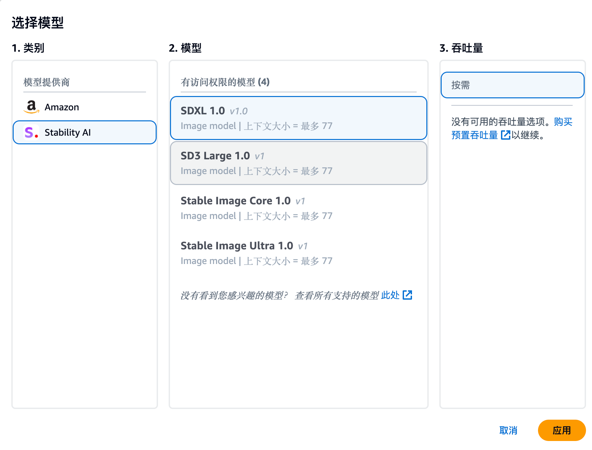
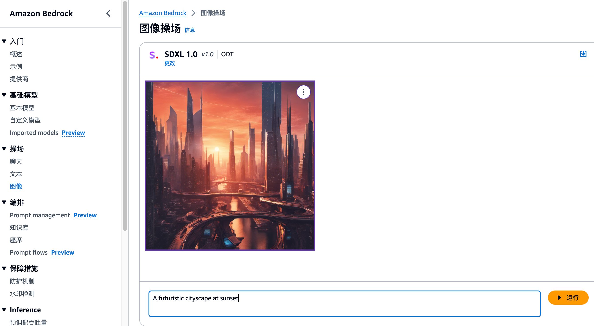

---

### **步骤 1：登录亚马逊云科技控制台**

打开浏览器，进入 [Amazon Web Services 管理控制台](https://aws.amazon.com/console/)。输入你的 Amazon Web Services 账户登录信息并登录。

### **步骤 2：进入 Bedrock 服务**

在亚马逊云科技控制台的顶部搜索栏中，输入 **“Bedrock”** 并按下 `Enter` 键。在搜索结果中找到 **Amazon Bedrock**，点击进入服务页面。

### **步骤 3：选择 Stable Diffusion 模型**

进入 Bedrock 控制台后，点击【操场】-【图像】，选择 **“选择模型**”，在本示例中，我们将选择 Stable Diffusion XL - SDXL 1.0。 然后选择 “**应用**”。点击 **Stable Diffusion** 模型名称或图标，进入模型详情页面。

### **步骤 4：配置并测试模型**

你可以输入一个文本提示（Prompt），这将用于生成图像。例如，可以输入 **“A futuristic cityscape at sunset”** 作为提示语。

1. 点击 **“Generate”** 按钮（生成）开始生成图像。
   - Stable Diffusion 模型会根据你的提示生成相应的图像。

2. 模型处理完成后，页面会展示生成的图像。
   - 你可以点击图像以查看更大的预览，或者点击 **“Download”** 按钮下载图像。
3. 如果你对结果不满意，可以调整提示语并再次生成图像。

