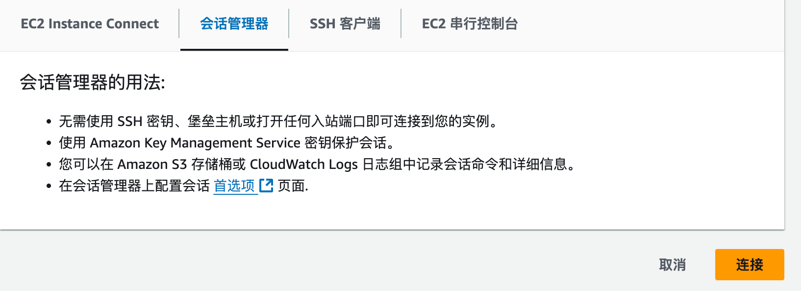

Boto3 是 Amazon Web Services 官方提供的 **Python 软件开发工具包 (SDK)**，用于与 AWS 服务进行交互。它使得开发者可以通过 Python 代码轻松访问并管理 AWS 服务，例如 Amazon S3、EC2、DynamoDB、Lambda 等。


在本次实验中，我们提供了EC2的来运行这个代码，并且在EC2上安装了code-server，并且安装了Python的运行环境，这个是EC2初始化的脚本：

```bash
#!/bin/bash
# Update system and install necessary tools
sudo yum update -y

# Install Docker
sudo yum install docker -y
sudo service docker start
sudo usermod -a -G docker ec2-user

# Pull Code Server Docker image
sudo docker pull codercom/code-server:latest

docker run -d --name code-server -p 8080:8080 \
  --restart always \
  codercom/code-server:latest

sudo docker exec code-server sudo apt update
sudo docker exec code-server sudo apt install python3 python3-pip -y
```


我们需要做的操作有，

1. 启动EC2， 获取EC2的IP地址，code-server启动在8080端口上
2. 通过EC2instance Connect或者SSM agent登录到EC2中，执行命令获取密码code-server密码：


```bash
sudo docker exec -it code-server cat /home/coder/.config/code-server/config.yaml
```

3. 访问http://IP:8080 进入code-server



当然您同样也可以自行安装Conda虚拟环境或者Pyenv，安装它非常简单。

### 1. **确保你已经安装了 Python**

在安装 Boto3 之前，首先确保你的电脑已经安装了 Python。你可以通过以下命令检查是否已经安装：

```bash
python --version
```

如果你没有安装 Python，可以从 [Python 官方网站](https://www.python.org/downloads/) 下载并安装最新版本。

### 2. **安装 pip（Python 包管理工具）**

大多数 Python 发行版都会自带 `pip`，这是用于安装 Python 包的工具。如果你的系统没有 pip，或者你想更新到最新版本，可以通过以下命令进行安装或更新：

```bash
python -m ensurepip --upgrade
```

然后验证 pip 是否已经正确安装：

```bash
pip --version
```

### 3. **安装 Boto3**

使用 pip 来安装 Boto3。打开终端（或命令行），输入以下命令进行安装：

```bash
pip install boto3
```

### 4. **验证 Boto3 是否安装成功**

安装完成后，你可以通过以下命令验证 Boto3 是否成功安装：

```bash
python -c "import boto3; print(boto3.__version__)"
```

如果安装成功，它会输出 Boto3 的版本号。

### 5. **安装虚拟环境（可选）**

为避免在全局环境中安装包，你可以使用 Python 的虚拟环境（`virtualenv` 或 `venv`）来隔离项目中的依赖包。

#### 创建虚拟环境：

```bash
python -m venv myenv
```

#### 激活虚拟环境：

- **Windows**:

  ```bash
  myenv\Scripts\activate
  ```

- **MacOS/Linux**:

  ```bash
  source myenv/bin/activate
  ```

虚拟环境激活后，你可以在其中安装 Boto3 和其他依赖包，不会影响全局环境。

现在你已经成功安装并配置了 Boto3，可以开始使用它来与 Amazon Web Services 服务进行交互！
