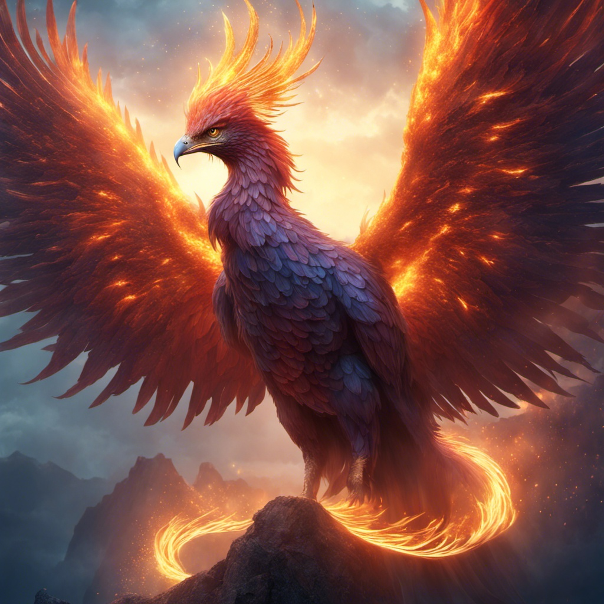

## 步骤0: 实验目录结构准备

1. **文本生成图像**: 根据提供的文本提示生成静态图像，并保存到 `source/img` 目录。
   - 输入：text
   - 输出：`source/img`  
   
2. **图像生成图像**: 基于现有的静态图像生成新的图像，结果保存到 `generate/img` 目录。
   - 输入：`source/img`  
   - 输出：`generate/img`  
4. **动图生成动图** :动图切分成帧后生成新帧，并合成新的动图文件，保存到 `generate/videos/{name}`。
   - 输入：`source/video`  
   - 切分：`source/frames/{name}`  
   - 生成：`generate/frames/{name}`  
   - 合成：`generate/videos/{name}`  

#### 创建目录结构

```bash
mkdir -p ./source/img 
mkdir -p ./source/frames
mkdir -p ./source/videos

mkdir -p ./generate/img
mkdir -p ./generate/frames
mkdir -p ./generate/videos
```


## 实验1:文本生成图像示例


本实验代码演示了如何通过Amazon Bedrock服务调用Stable Diffusion XL（SDXL）模型，根据文本提示生成高质量图像。代码使用了`boto3` SDK与Bedrock服务交互，并借助`PIL`库处理生成的图像。

让我们从一个简单的文本到图像示例开始。我们将使用 Boto3 Python SDK 和 Amazon Bedrock Stability.ai Stable Diffusion XL 1.0。我们将传入正向和负向提示并生成图像。下面的代码是 Amazon Web Services 文档的[示例代码](https://docs.aws.amazon.com/bedrock/latest/userguide/model-parameters-diffusion-1-0-text-image.html#model-parameters-diffusion-1-0-code-example).


#### 实验步骤

1. **环境依赖**
   需要以下Python库：
   
   - `boto3`: 用于与AWS服务交互
   - `PIL` (Python Imaging Library): 用于处理生成的图像
   - `json`, `base64`, `logging`, `time`, `io`: 标准库模块
   
   可通过以下命令安装依赖项：
   ```bash
   pip3 install boto3 Pillow
   ```
   
2. **模型设置**
   ```python
   MODEL_ID = "stability.stable-diffusion-xl-v1"
   GENERATED_IMAGES = "./source/img"
   ```

   这里设置了要使用的模型ID为`stability.stable-diffusion-xl-v1`，生成的图像将保存到`./source/img`目录下。

3. **日志初始化**
   ```python
   logging.basicConfig(level=logging.INFO)
   logger = logging.getLogger(__name__)
   ```
   日志用于输出信息和错误。

4. **图像生成函数**
   - `generate_image_from_text`: 调用Bedrock模型生成图像。输入模型ID和请求体，返回图像的字节数据。 
   - `text_to_image_request`: 封装了请求体的生成，并将返回的图像保存为JPEG格式。请求体包括正面提示词（positive prompt）和反面提示词（negative prompt）。

   ```python
   def generate_image_from_text(model_id, body):
       bedrock = boto3.client(service_name="bedrock-runtime")
       response = bedrock.invoke_model(
           body=body, modelId=model_id, accept="application/json", contentType="application/json"
       )
       response_body = json.loads(response.get("body").read())
       base64_image = response_body["artifacts"][0]["base64"]
       image_bytes = base64.b64decode(base64_image.encode("ascii"))
   
       if response_body["artifacts"][0]["finishReason"] in ["ERROR", "CONTENT_FILTERED"]:
           raise Exception(f"Image generation error: {response_body['artifacts'][0]['finishReason']}")
       return image_bytes
   
   def text_to_image_request(model_id, positive_prompt, negative_prompt):
       body = json.dumps({
           "text_prompts": [
               {"text": positive_prompt, "weight": 1},
               {"text": negative_prompt, "weight": -1},
           ],
           "height": 1024,
           "width": 1024,
           "cfg_scale": 12,
           "sampler": "K_DPMPP_2M",
           "samples": 1,
           "seed": 123456,
           "steps": 25,
           "style_preset": "fantasy-art",
       })
   
       try:
           image_bytes = generate_image_from_text(model_id, body)
           image = Image.open(io.BytesIO(image_bytes))
           generated_image_path = f"{GENERATED_IMAGES}/image_{int(time.time())}.jpg"
           image.save(generated_image_path, format="JPEG", quality=95)
           logger.info(f"Generated image: {generated_image_path}")
       except ClientError as err:
           logger.error(f"A client error occurred: {err.response['Error']['Message']}")
       except Exception as err:
           logger.error(err.message)
   ```

5. **提示词设置**
   实验通过正向提示词生成图像，同时使用负向提示词过滤低质量元素：
   ```python
   POSITIVE_PROMPT = "mythical beast, Phoenix, cinematic lighting, high level of detail, masterpiece, best quality, 8k"
   NEGATIVE_PROMPT = "(worst quality:1.5), (low quality:1.5), lowres, bad anatomy, bad hands, watermark"
   ```

6. **图像生成**
   最后调用`text_to_image_request`函数，传入模型ID和提示词开始生成图像：
   ```python
   text_to_image_request(MODEL_ID, POSITIVE_PROMPT, NEGATIVE_PROMPT)
   ```

#### 实验结果
运行此脚本后，生成的图像将保存在`./source/img`目录中，图像文件以时间戳命名。




**完整代码如下：**

```python
import os
import json
import time
import io
import base64
import logging
import boto3
from PIL import Image
from botocore.exceptions import ClientError


# 模型和路径
MODEL_ID = "stability.stable-diffusion-xl-v1"
GENERATED_IMAGES = "./source/img"

# 日志设置
logging.basicConfig(level=logging.INFO)
logger = logging.getLogger(__name__)


def generate_image_from_text(model_id, body):
    logger.info("Generating image with SDXL model %s", model_id)
    bedrock = boto3.client(service_name="bedrock-runtime",region_name='us-west-2')
    response = bedrock.invoke_model(
        body=body, modelId=model_id, accept="application/json", contentType="application/json"
    )
    response_body = json.loads(response.get("body").read())
    # print(response_body)
    base64_image = response_body["artifacts"][0]["base64"]
    print(base64_image)
    image_bytes = base64.b64decode(base64_image.encode("ascii"))

    if response_body["artifacts"][0]["finishReason"] in ["ERROR", "CONTENT_FILTERED"]:
        raise Exception(f"Image generation error: {response_body['artifacts'][0]['finishReason']}")

    return image_bytes


def text_to_image_request(model_id, positive_prompt, negative_prompt):
    body = json.dumps({
        "text_prompts": [
            {"text": positive_prompt, "weight": 1},
            {"text": negative_prompt, "weight": -1},
        ],
        "height": 1024,
        "width": 1024,
        "cfg_scale": 12,
        "sampler": "K_DPMPP_2M",
        "samples": 1,
        "seed": 123456,
        "steps": 25,
        "style_preset": "fantasy-art",
    })

    try:
        image_bytes = generate_image_from_text(model_id, body)
        image = Image.open(io.BytesIO(image_bytes))
        generated_image_path = f"{GENERATED_IMAGES}/image_{int(time.time())}.jpg"
        image.save(generated_image_path, format="JPEG", quality=95)
        logger.info(f"Generated image: {generated_image_path}")
    except ClientError as err:
        logger.error(f"A client error occurred: {err.response['Error']['Message']}")
    except Exception as err:
        logger.error(err.message)


# 设置提示词
POSITIVE_PROMPT = "mythical beast, Phoenix, cinematic lighting, high level of detail, masterpiece, best quality, 8k"
NEGATIVE_PROMPT = "(worst quality:1.5), (low quality:1.5), lowres, bad anatomy, bad hands, watermark"

# 生成图像
text_to_image_request(MODEL_ID, POSITIVE_PROMPT, NEGATIVE_PROMPT)
```


