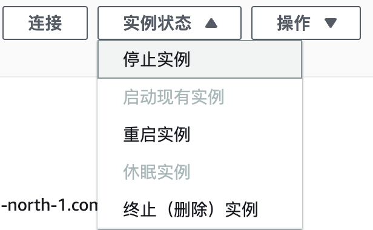

我们建议您在实验完成之后，及时清理实验资源，避免产生额外的费用。

资源清理方法：

- 停止Amazon EC2，参考[文档](https://docs.aws.amazon.com/zh_cn/AWSEC2/latest/UserGuide/Stop_Start.html)
- 终止Amazon EC2, 参考[文档](https://docs.aws.amazon.com/zh_cn/AWSEC2/latest/UserGuide/terminating-instances.html)
- 删除 Amazon EBS 卷, 参考[文档](https://docs.aws.amazon.com/zh_cn/ebs/latest/userguide/ebs-deleting-volume.html)

