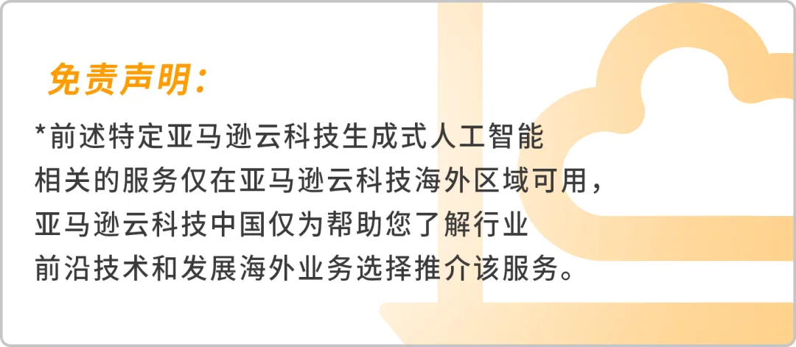

在本实验中，我们向您展示了如何在 Bedrock 上使用体验生成式AI，以及以Stable Diffusion为生成图片和视频的风格迁移作例子。

您现在可以借助 Bedrock访问Stable Diffusion的基础模型。除此之外，您还可以访问来自 AI21 Labs、Anthropic、Cohere、Meta、Mistral AI、Stability AI 和 Amazon等公司的先进模型，无论您选择哪种模型，Amazon Bedrock 的单一 API 访问都可以让您灵活地使用不同的 FM，并且只需最少的代码更改即可升级到最新的模型版本。

### 注意事项

- **优化提示语**：生成的图像质量依赖于提供的提示语。尝试通过更加详细和具体的描述来生成更精确的图像。
- **成本管理**：务必在 Amazon Web Services 成本管理工具中监控 Bedrock 的使用情况，避免不必要的费用。

通过这些步骤，用户能够轻松地通过 Amazon Bedrock 使用 Stable Diffusion 模型生成图像。如果教程中需要插入屏幕截图，可以通过截取关键页面来帮助用户理解每个点击操作。

> 请注意，这个例子仅用于演示如何构建API调用的基本结构，实际的API调用可能需要更多的参数和配置，具体取决于你的需求和Amazon Bedrock提供的功能。在实际应用中，你可能需要根据Amazon Bedrock的文档来调整参数和处理响应。

> 此外，由于Amazon Bedrock是一个收费服务，确保你了解相关的费用和定价模型。在生产环境中使用之前，建议进行充分的测试和成本评估。

